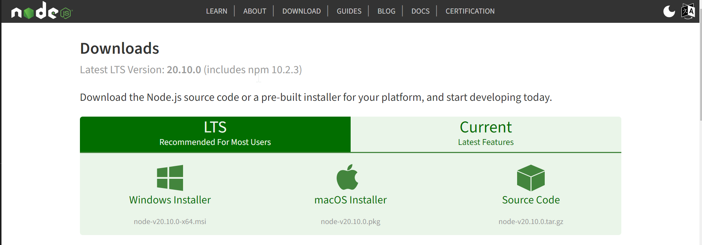
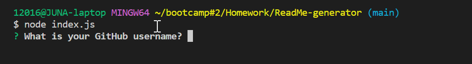

# ReadMe-Generator

## Description
README's are important to have so that other developers who come upon your project know what the app is for, how to usee it, how to install it, who and how to report any issues, and how to make contributions. With this ReadMe generator, it is a quick and easy way to generate professional ReadME.md files from a user's input through the command-line. Using this generator can allow project creators to spend more time working on their project(s).

## Installation
Before running the ReadMe generator, you must first make sure to have [**Node.js**](https://nodejs.org/en/download) installed.




# Usage
First, make sure a README.md file is created and available for your project in your repo. Modify the filepath in the script to where your README.md file is located.

```bash
function writeToFile(data, filePath = ''){} 
```


The generator will be invoked by running the following command in your terminal:

```bash
node index.js
```

Once the command is entered, you should see the first question appear in your terminal like so.



After inputting the initial response, it will continue to prompt for information about your application repository, which is then used to generate a high-quality, professional README in your README.md file.

## Link
Here is a video link to see the functionality of this generator: [Watch Me!](https://drive.google.com/file/d/15uAJ1a_kkJwXjopTdoUB7GD4xx1ImJ8t/view?usp=drive_link)
